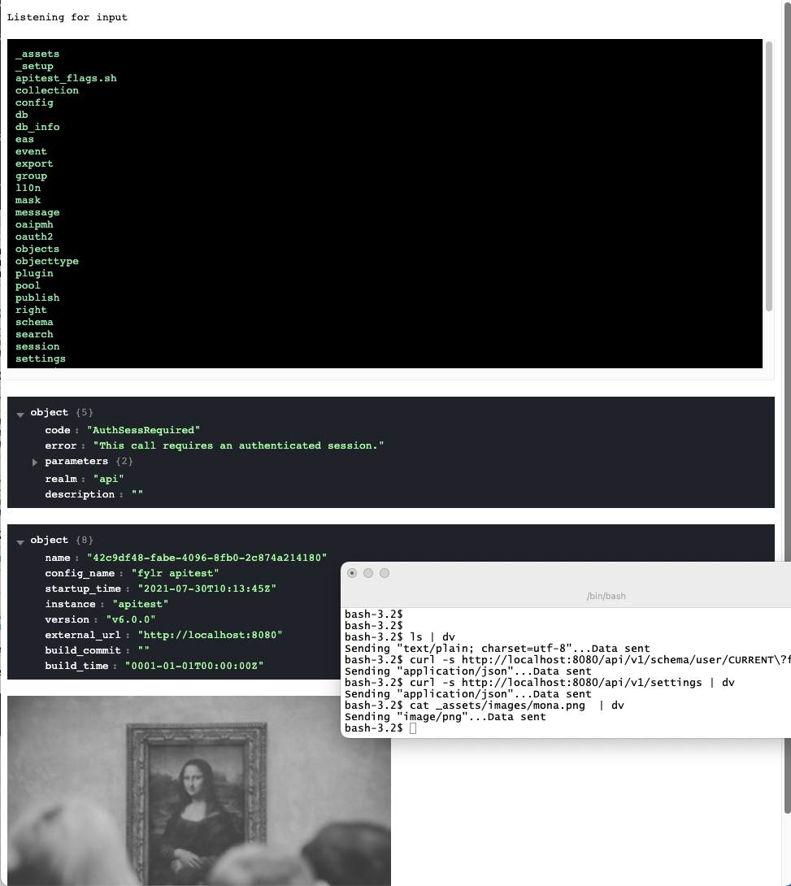

# dv
Simple Websocket based data visualization server

## Usage

### Start the server

```bash
# dv --server
```

### Open your browser

```
http://localhost:10000
```

### Start showing any data

```bash
# cat image.jpg | dv
# curl source.com/some.json | dv
# ls | dv
```


